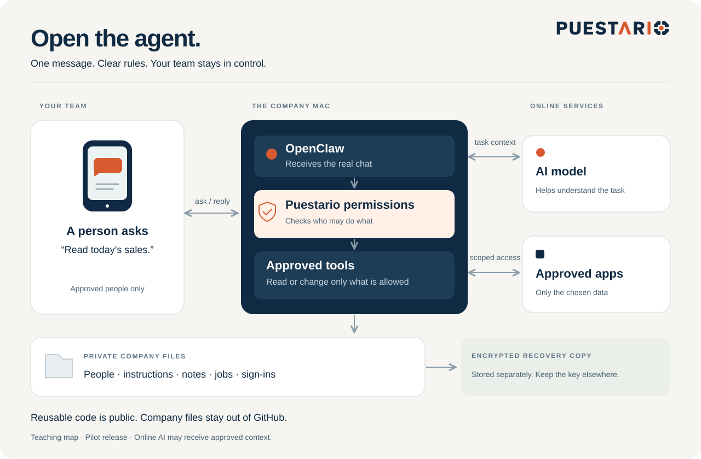

# Puestario Agent Desk

[](https://github.com/Puestario/Puestario-v1-agent-for-generic-company/actions/workflows/tests.yml)
[](LICENSE)

**One company. One private workspace. Approved people. Approved tasks.**

An open-source starter kit for an internal business assistant on a dedicated Mac mini and WhatsApp. Built by [Puestario](https://puestario.com).

**0.2.0-pilot:** ready for developer review and controlled testing. A real Mac, phone and business-app pilot is still required before client handover. No claim of a completed live pilot, security certification, or 30-minute installation.

[Start in English](START-HERE.md) · [Empieza en español](docs/es/EMPIEZA-AQUI.md) · [Explore the visual guide](https://puestario.com/agent-guide) · [What is verified](docs/RELEASE-STATUS.md)



## What can it do?

| It can | Its limit |
|---|---|
| Read a sales sheet | Only an approved, bounded range |
| Update a sheet | Only an explicitly writable range, followed by a read-back |
| Read Calendar, Stripe or GHL | Limited read-only results; incomplete results are labeled |
| Remember a private note | Only for the person in that private chat |
| Send a reminder or a small report | Only to approved people/groups, with permissions checked again at delivery |
| Let administrators manage access | Verified private messages; either administrator can act independently |
| Create a recovery copy | Encrypted before it leaves the machine; restored work starts paused |

**It cannot pay, charge, refund, email customers, control the whole computer, or run arbitrary commands.** It does not include a Telegram backup, voice processing, automatic nightly backups, or every integration used by Puestario's existing agents. [Full limits](docs/RELEASE-STATUS.md).

## What is in the folders?

| Folder | Think of it as |
|---|---|
| `managed/` | The installer, permission checks, app tools, reminders and recovery |
| `runtimes/openclaw/` | The connection between OpenClaw and those protected tools |
| `docs/` | The map, installation instructions and operator/client guides |
| `tests/` | Automatic checks with made-up company information |
| `evals/` | Tools for recording and scoring trials you actually run |

The installer creates a **separate private company folder outside this repository**. Its sign-ins, people, chats, notes and reports never belong in GitHub. It also creates all seven instruction files in the place OpenClaw reads. You do not copy a collection of prompts and hope they load.

## Choose your next step

- **Understand it:** [the picture and plain explanation](docs/ARCHITECTURE.md).
- **Install it:** [Start Here](START-HERE.md), then the [installer guide](docs/MANAGED-INSTALL.md).
- **Use it:** [client guide, English and Spanish](docs/CLIENT-GUIDE.md).
- **Improve it:** [contribution guide](CONTRIBUTING.md).
- **Report a security concern privately:** [security policy](SECURITY.md).
- **Hire Puestario:** [installation and support](https://puestario.com/contact). The MIT code is free; the managed service is a separate agreement.

## Check the code

Use Python 3.11+, Node 22.22+ and age 1.3.2 with age-keygen. The optional Drive uploader has its own pinned dependencies. [Exact versions](managed/release.json).

```bash
python3 -m unittest discover -s tests -v
python3 tests/ci_checks.py all
python3 tests/public_scan.py --history
```

Tests use fictional data. No phone is paired and no business message is sent. CI installs checksum-verified encryption tools so the backup tests use real encryption. Passing these tests does not replace the [live acceptance checks](docs/ACCEPTANCE.md).

## Version and license

This release replaces the earlier `core/` + `client/` template with the managed architecture used by the website guide. The guide displays a reviewed snapshot and names its source revision. [Upgrade notes](docs/CLEANUP.md) · [Changelog](CHANGELOG.md).

[MIT](LICENSE), copyright 2026 Puestario LLC. You may use, change and redistribute the code, including commercially, subject to the license notice. Dependencies keep their own licenses. Using this code does not make you a Puestario partner or grant permission to imply Puestario endorsement.

## Español

Este kit crea un asistente interno para una empresa. Solo ayuda a las personas autorizadas y usa las herramientas permitidas. Los datos reales se guardan en una carpeta privada, fuera de GitHub. Es una versión piloto: faltan las pruebas con Mac, teléfono y aplicaciones reales antes de entregarla a un cliente.

[Empieza aquí](docs/es/EMPIEZA-AQUI.md) · [Mira el mapa](docs/es/ARQUITECTURA.md) · [Guía visual en español](https://puestario.com/es/agent-guide)
