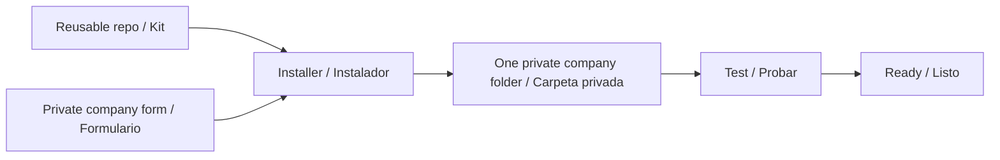
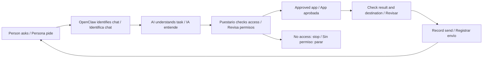
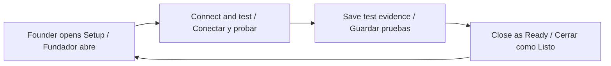

# Understand the desk / Entiende el agente

**Open [the interactive visual guide](https://puestario.com/agent-guide) in a browser.** It is available on the website in English or Spanish, with made-up examples. Its buttons explain the system; they do not change a live agent.

**Abre [la guía visual interactiva](https://puestario.com/agent-guide) en un navegador.** Está en el sitio web, en inglés y español. Los botones explican; no cambian un agente real.

## Learn by opening the agent / Aprende abriendo el agente

1. **The agent / El agente:** open a book, permission shield, toolbox, notebook, clock or recovery kit. Each object has one clear job. The named parts stay beside the lesson; on a phone, open “Explore the parts / Explora las partes” to move around.
2. **The instruction book / El libro de instrucciones:** choose one of its seven pages. On SOUL.md, try a short answer, a language change or a check-before-success rule. These are labeled teaching examples, not model test results. “Open this real file / Abre este archivo real” leads to its contents, owner of changes and exact generator code.
3. **Permissions / Permisos:** try reading approved sales, asking for another person’s notes or changing company settings. Each example explains what the code checks. The control.py button opens the matching source lines. This is a local teaching example, not a live permission test.
4. **Folders / Carpetas:** switch between the reusable GitHub kit, one company's private Mac folder and items kept separately.
5. **See it work / Mira cómo trabaja:** walk through a reminder, a Sheets read, adding a person, a blocked private-note request or finishing Setup.
6. **Practice / Practicar:** point to the part that handles a job. The five practice questions are learning exercises, not installer certification.

The design supports English and Spanish, narrow screens, keyboard navigation and reduced motion. The map, book, folders and code views are parts of the same teaching guide. The nine studio illustrations are embedded in the guide. They represent software concepts, not physical components inside the Mac.

La guía funciona en inglés y español, en pantallas pequeñas y con teclado. Respeta la preferencia de reducir movimiento. Las partes tienen nombres visibles. En el teléfono, abre “Explora las partes” para cambiar de sección. Los dibujos representan programas y archivos, no piezas físicas de la Mac.

The website guide describes this managed architecture. Its version panel names the exact source snapshot it displays; a snapshot may lag a newer release. Use this repository’s tagged source and current setup instructions for installation.

La guía web explica esta arquitectura. Su panel de versión muestra la revisión exacta del código. Para instalar, usa la versión etiquetada de este repo y sus instrucciones actuales.

## 1. The kit is not the company / El kit no es la empresa



The repo holds reusable programs. `managed/company.example.json` is the blank form. `managed/install.py` creates the company's private folder. It starts **not ready**. The installer must connect the phone, model and approved apps, then prove the limits work.

El repo tiene los programas. El formulario define la empresa. El instalador crea su carpeta privada. Empieza **sin estar listo**. Hay que conectar y probar.

## 2. Follow a message / Sigue un mensaje



The model helps understand the request. The protected code decides what it may do. The AI model is normally an online service: a Mac mini does not mean all information stays on the Mac. Approved source data may be sent to the selected model to answer. Choose providers and data rules with the client.

La IA entiende la petición. El código protegido decide qué permite. El modelo suele funcionar por internet: tener una Mac mini no significa que todos los datos se queden en ella. Acuerden qué datos pueden ir al proveedor de IA.

| Plain name / Nombre sencillo | Actual file / Archivo |
|---|---|
| Message bridge / Puente de mensajes | `runtimes/openclaw/plugins/puestario-control/bridge.js` |
| Permission checker / Revisa permisos | `managed/control.py` |
| Company record / Registro de empresa | `control.json` on the company Mac |
| Record keeper / Guarda cambios | `managed/store.py` |
| App connections / Conexiones | `managed/adapters.py` |
| Settings and clock / Ajustes y reloj | `managed/runtime.py` |
| Send record / Registro de envíos | `managed/action_log.py` and the action-log plugin |

## 3. Inside one company folder / Dentro de una empresa

```text
example-office/
├── control.json          people, access, notes, jobs / personas, permisos, notas, tareas
├── workspace/            7 shared instruction files / 7 instrucciones compartidas
├── gateway/              OpenClaw settings and sessions / ajustes y sesiones
├── secrets/              private app sign-ins / accesos privados
├── release/              installed programs / programas instalados
├── security/             activity records / registros
├── evidence/             saved acceptance checks / pruebas guardadas
└── release-manifest.json exact program version / versión exacta
```

The installer also creates an empty `backups/` folder. The encrypted `.age` backup file must be written **outside** the company folder. The recovery key is stored separately. Making a backup and uploading it to Drive do not create an automatic backup schedule.

La copia cifrada se guarda **fuera** de la carpeta de empresa. Su clave se guarda aparte. Crear o subir una copia no programa copias automáticas.

| Shared instruction / Instrucción | What it means / Significado |
|---|---|
| `IDENTITY.md` | Agent and company name / Nombre del agente y empresa |
| `SOUL.md` | Speaking style / Forma de hablar |
| `USER.md` | Language and time zone / Idioma y zona horaria |
| `AGENTS.md` | Steps to follow / Pasos de trabajo |
| `TOOLS.md` | How to ask for approved tools / Cómo pedir herramientas |
| `HEARTBEAT.md` | Use the protected scheduler / Usar el reloj protegido |
| `MEMORY.md` | How to use private notes; not the notes themselves / Cómo usar notas; no contiene las notas |

`managed/runtime.py` creates these seven files. Shared instructions can be seen by agent sessions. Do not put private notes or passwords there. A developer changes the generator; the installer changes approved company settings. Hand-editing generated files can be overwritten.

## 4. Open, set up, close / Abrir, preparar, cerrar



- Either founder can act alone in a verified private chat. Setup lasts 15 minutes by default, up to 60. Restart or expiry closes temporary access.
- Company/app setup changes need Setup. Adding/removing staff and approved group permissions remains founder-only and can be done in Ready.
- After an access change, old staff/group sessions expire. Send `/new`. The running gateway must confirm the new settings before staff work resumes.
- Staff use only their granted data. The client owner is not automatically a Puestario founder administrator.
- Closing Setup is not a padlock on the physical Mac. Device access, FileVault, device management and recovery ownership still matter.

En español: cualquiera de los dos administradores puede hacer cambios por su chat privado verificado. Setup abre por 15 minutos, hasta 60. Cerrar Setup no les quita el control. El personal solo usa sus permisos. El equipo físico también debe protegerse. El dueño del cliente no recibe permiso de fundador automáticamente.

## 5. What works now / Qué funciona hoy

| Connection / Conexión | Current limit / Límite actual |
|---|---|
| Google Sheets | One approved range; up to 100 columns, 1,000 rows and 10,000 cells. Optional exact full-range RAW write with read-back. / Un rango aprobado; edición exacta si se permite. |
| Google Calendar | Next 50 upcoming events, read only. / Próximos 50 eventos, solo lectura. |
| Stripe | Up to 100 charges from the last 24 hours; not full accounting. / Hasta 100 cobros de las últimas 24 horas; no contabilidad completa. |
| GHL | Up to 100 contacts in one verified location, read only. / Hasta 100 contactos en una ubicación verificada. |
| Reminders / Recordatorios | One future time, daily time or interval; time zone and recipient saved. / Una fecha, hora diaria o intervalo. |
| Scheduled report / Informe programado | A label plus data from one approved source; text under 3,500 characters. / Etiqueta y datos de una fuente; menos de 3.500 caracteres. |

If a source says `more_available`, the result is incomplete. Never call it a full total. No arbitrary shell cron, general desktop work, Telegram backup, email sending, Calendar editing or full legacy agent migration is included.

Si faltan más datos, no es un total completo. Las funciones futuras están en [ROADMAP.md](ROADMAP.md). Las pruebas pendientes están en [ACCEPTANCE.md](ACCEPTANCE.md).
