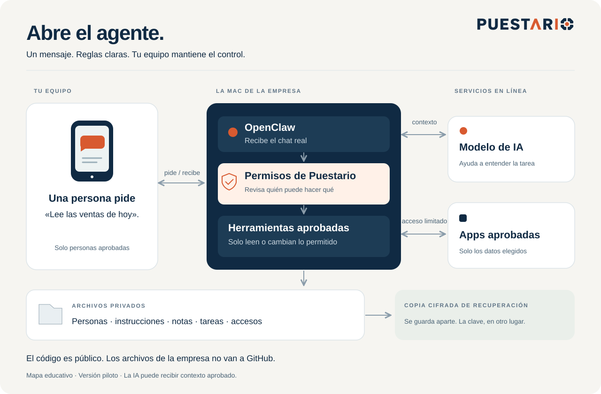

# Abre el agente

[English](../ARCHITECTURE.md) · [Versión interactiva](https://puestario.com/es/agent-guide)

## Sigue una petición

1. **Una persona pide:** «Lee las ventas de hoy».
2. **OpenClaw recibe el mensaje:** entrega el remitente y chat reales.
3. **Puestario revisa el permiso:** bloquea personas o fuentes no autorizadas.
4. **La IA en internet ayuda a elegir una acción permitida.** Recibe el contexto necesario; no puede inventar la identidad ni darse permiso.
5. **Una herramienta protegida lee la fuente aprobada.** El código revisa el acceso y comprueba el destino antes de responder.

El dibujo explica el sistema. No se conecta a un agente real.

## Los tres lugares

| Lugar | Qué guarda |
|---|---|
| Repo público en GitHub | Código reutilizable, ejemplos inventados, instrucciones y pruebas |
| Carpeta privada de la empresa en la Mac | Programas, instrucciones, accesos, permisos, notas, trabajos y registros |
| Almacenamiento de recuperación separado | Copia cifrada; la llave privada se guarda en otro lugar |

`managed/install.py` crea la carpeta. `managed/runtime.py` escribe los siete archivos de instrucciones y la configuración de OpenClaw. `managed/control.py` revisa personas y acciones. `managed/adapters.py` conecta las aplicaciones. `managed/backup.py` cifra y restaura.

El operador elige los administradores. Sus números, notas privadas y claves no van en las instrucciones compartidas. El personal no recibe una terminal ni acceso general a los archivos.

La Mac está en la oficina; el modelo y las aplicaciones pueden estar en internet. Revisa [los límites](../RELEASE-STATUS.md) antes de elegir el trabajo.
