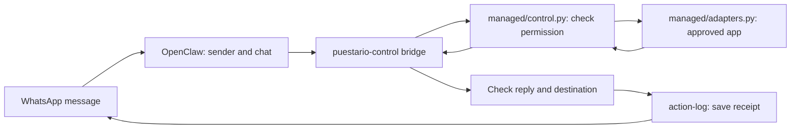

# How Puestario connects to OpenClaw

Use [SETUP.md](../../SETUP.md) and [the installation manual](../../docs/MANAGED-INSTALL.md). This folder is for the pinned **OpenClaw 2026.5.27** release. Do not apply instructions for a newer runtime without a compatibility review.

- `plugins/puestario-control/index.js`: registers the protected tool, `/desk`, hooks and persistent scheduler.
- `plugins/puestario-control/bridge.js`: uses runtime sender/account/chat context, calls the controller and blocks unapproved tools or output.
- `plugins/action-log/`: records an outgoing message fingerprint before sending. Failure to record cancels sending. Outcome recording is best effort.
- `Dockerfile.managed`: builds the pinned sandbox image. Live blocked-action tests are still required.

`managed/runtime.py` generates seven workspace instruction files and a separate `gateway/openclaw.json`. It sets `skipBootstrap`, an explicit company workspace and state directory, separate private conversations, the approved tool, sandbox settings and both plugins. The shared files hold no real founder numbers, credentials or private notes.

The retired workspace builder and memory-bootstrap hook are no longer part of this repo. `MEMORY.md` tells the model how to use protected private notes; it is not a shared diary.

OpenClaw's workspace is not a security boundary by itself. Puestario combines generated settings, protected checks and the sandbox; the running installation must still pass denial tests. See the official [workspace](https://docs.openclaw.ai/concepts/agent-workspace), [security](https://docs.openclaw.ai/gateway/security) and [plugin](https://docs.openclaw.ai/tools/plugin) docs. Current web docs may describe a newer version; the pinned package's bundled docs and live compatibility checks control this release.

## Español

OpenClaw recibe el mensaje y conoce quién lo envió. El puente de Puestario comprueba la identidad. El controlador revisa permisos. La conexión aprobada consulta la aplicación. Antes de responder, se revisa el destino y se guarda el registro del envío.

Los archivos de instrucciones ayudan al modelo. Los programas protegidos deciden qué puede hacer. Hay que probar esos límites en el equipo real.
